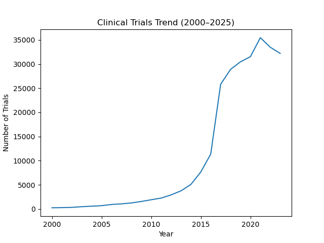
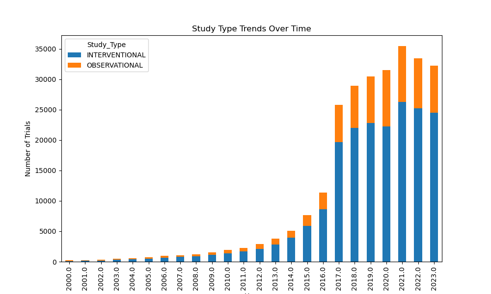
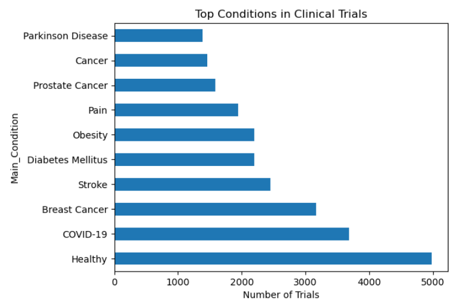
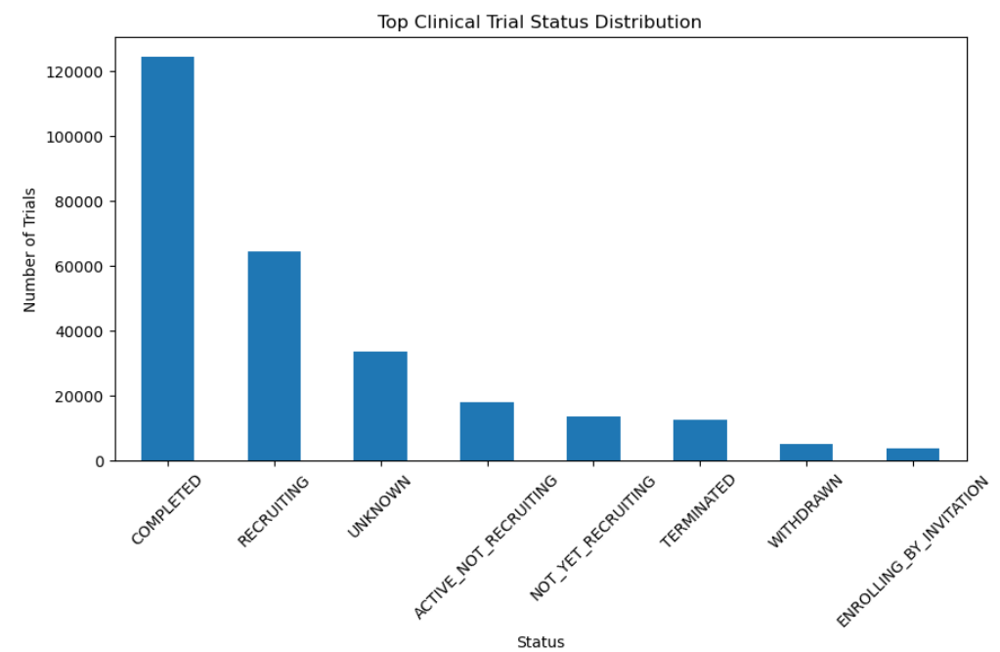

# Clinical Trial Data Analysis & Insights (Healthcare Analytics Project)

## 📌 Overview
This project analyzes real-world clinical trial data to uncover trends in research activity, disease focus, and study patterns. The goal is to generate actionable insights that support data-driven decision-making in the healthcare and pharmaceutical industry.

---

## 🎯 Objectives
- Analyze trial status distribution  
- Identify major disease areas under research  
- Examine organizations conducting clinical trials  
- Study trends over time  
- Compare study types and phases  

---

## 🛠 Tools & Technologies
- Python (Pandas, Matplotlib, Seaborn)  
- SQL (SQLite)  
- Jupyter Notebook  

**Dataset:** ClinicalTrials.gov dataset (public healthcare dataset)

---

## 📊 Key Insights
- Majority of clinical trials are completed or actively recruiting  
- Interventional studies dominate clinical research  
- Cancer and chronic diseases are the most researched areas  
- Major contributors include NIH, Pfizer, AstraZeneca, and other research institutions  
- Clinical trials have increased significantly after 2000  
- Presence of missing and 'Unknown' values highlights real-world data challenges  

---

## 📈 Key Visual Insights

### Clinical Trial Trends


### Study Type Trends (Stacked Analysis)


### Top Conditions in Clinical Trials


### Trial Status Distribution


---

## 📂 Project Structure
```text
clinical-trial-analysis/
├── clinical-trial-analysis.ipynb
├── clinical_trials_trend.png
├── study_type_trend.png
├── top_conditions.png
├── trial_status_distribution.png
└── README.md
```
---

## 🚀 How to Run
1. Clone the repository  
2. Open the notebook in Jupyter Notebook  
3. Run all cells sequentially  

---

## 🔮 Future Improvements
- Build interactive dashboards using Power BI or Tableau  
- Perform predictive analysis on clinical trial outcomes  
- Integrate real-time healthcare datasets  

---

## 🏁 Conclusion
This project demonstrates how data analytics can be applied to healthcare datasets to extract meaningful insights. It highlights key trends in clinical research and shows how data-driven approaches can support decision-making in healthcare and pharmaceutical industries.
